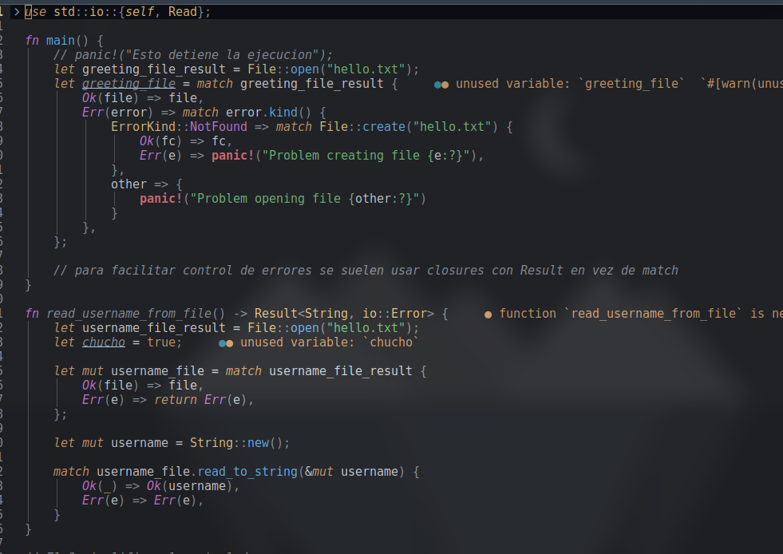

# almera.nvim

🎨 A modern, JetBrains-inspired colorscheme for Neovim — written in Lua.



## ✨ Features

- JetBrains / One Dark Pro inspired palette
- Full Treesitter highlight coverage
- LSP diagnostics support
- Neo-tree, cmp, and floating window styling
- Designed for readability and a calm UI experience

## 📦 Installation

### Using [lazy.nvim](https://github.com/folke/lazy.nvim)

```lua
{
  "ChristianRegueiro/almera.nvim",
  name = "almera",
  lazy = false,
  priority = 1000,
  config = function()
    vim.cmd("colorscheme almera")
  end,
}
```

## 🧠 Philosophy

This theme focuses on:
- Reducing visual fatigue
- Making unused code visually distinct
- Ensuring harmony between code, UI elements, and plugins

## 🧪 Supported plugins

- Treesitter
- LSP diagnostics
- Neo-tree
- nvim-cmp
- Telescope (in progress)

## 📜 License

This project is licensed under the [MIT License](./LICENSE.md).
